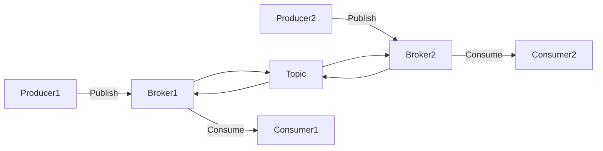
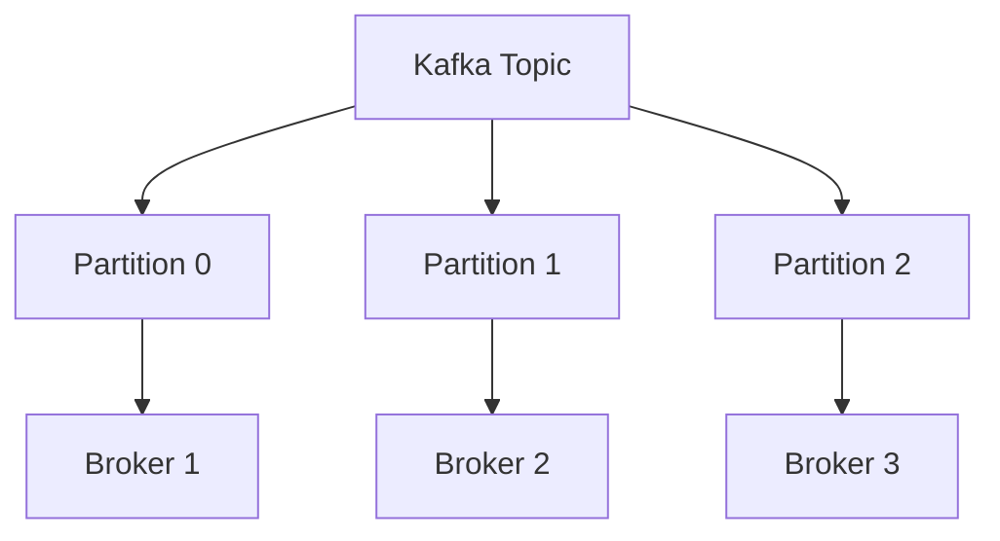
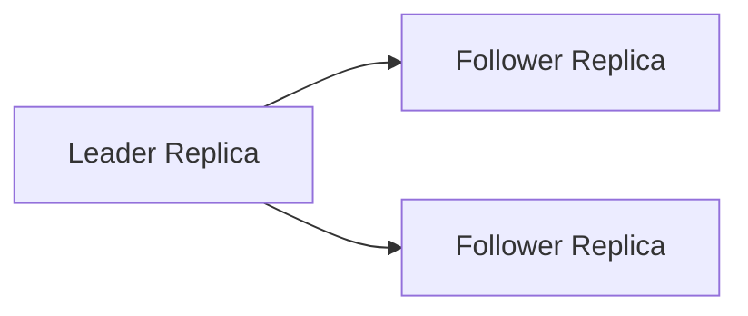

# Apache Kafka

Apache Kafka is an open-source distributed event streaming platform. It has a publish-subscribe messaging system which allows exchanging of data between applications, servers and processors as well. Kafka is written in Java and Scala. It is scalable and fault-tolerant and has topic-based partition FIFO queues.

## Why Apache Kafka
1. **High Throughput**: Deliver messages at network limited throughput using a cluster of machines with latencies as low as 2ms.
2. **Scalable**: Scale production clusters up to a thousand brokers, trillions of messages per day, petabytes of data, hundreds of thousands of partitions. Elastically expand and contract storage and processing.
3. **Permanent Storage**: Store streams of data safely in distributed, durable, fault-tolerant cluster.
4. **High Availability**: Stretch clusters efficiently over availability zones or connect separate clusters across geographic regions.
5. **Built-in Stream Processing**: Process streams of events with joins, aggregations, filters, transformations, and more, using event-time and exactly-once processing.
6. **Connect to almost anything**: Kafka’s out-of-the-box Connect interface integrates with hundreds of event sources and event sinks including Postgres, JMS, Elasticsearch, AWS S3, and more.
8. Resilient architecturve which has resolved unusual complications in data sharing.

## What is event streaming?
Event streaming is the process of capturing data in real-time from event sources like databases, sensors, mobile devices etc. in the form of stream of events, sotring these events durably for later retrieval. Kafka allows manipulating, processing and reacting to the event streams in real-time as well as retrospectively, routing the event streams to different destination technologies as needed. It ensures a continuous flow and interpretation of data so that the right info is at the right place at the right time.
Examples include processing payments, financial transactions in real-time; tracking and monitoring cars, truck, fleets and shipments; coontinuous capturing and analyzing of sensor data of IoT devices.


## What does it mean when it is said that Kafka is an event streaming platform?
Kafka combines 3 key capabilities:-
1. To publish (write) and subscribe (read) to streams of events, including continuous import/export of your data from other systems.
2. To store streams of events durably and reliably for as long as you want.
3. To process streams of events as they occur or retrospectively.

## Kafka Data Model
- Contains messages and topics
- Messages represent information such as lines in a log file, a row of stock market data or an error message from the system.
- Messages are goruped into categories called topics, e.g., logMessage or stockMessage.
- Topics are divided into one or more partitions. A partition is equivalent to a commit log.
- Each partition contains an ordered set of messages.
- Each message is identified by its offset in the partition.
- Messages are added at one end of the partition and consumed at the other
- Producers are processes that publish message into a topic.
- Consumers are processes that receive the messages from a topic.
- Brokers are processes or servers within Kafka that process the messages.
- A Kafka cluster consists of a set of brokers that process the messages.
- Each machine in the cluster can run one broker
- They cordinate amongst each other using zookeeper
- One broker acts as a leader for a partition and handles the delivery and persistence, while others act as followers.

## Partition Distributors
- Partitions can be distributed across Kafka clusters.
- Each Kafka server may handle one or more partitions.
- A partition can be replicated across several servers for fault tolerance
- One server is marked as a leader for the partiton and the others are marked as followers.
- The leader controls the read and write for the partition, the followers replicate the data.
- If a leader fails, one of the followers automatically becomes the leader.
- Zookeeper is used for leader selection.

## 3 Major components
1. **Kafka core**: A central hub to transport and store event streams in real time.
2. **Kafka connect**: A framework to import event streams from other source data systems into Kafka and export event streams from Kafka to destination data systems.
3. **Kafka Streams**: A Java library to process event streams live as they occur.

## Architecture

Apache Kafka follows a **distributed, log-based architecture** designed for scalability, durability, and fault tolerance.

At a high level, Kafka consists of **Producers**, **Brokers**, **Topics with Partitions**, and **Consumers**, all coordinated by **ZooKeeper (legacy) or KRaft (modern Kafka)**.

---

### High-Level Kafka Architecture


#### flow explanation
1. Producers publish messages to Kafka topics.
2. Kafka brokers store these messages in partitions.
3. Consumers fetch messages from brokers independently.

### Topic and Partition Architecture

- Topics are split into partitions for parallelism.
- Each partition is an ordered, immutable log.
- Ordering is guaranteed only within a partition.

### Partition Replication and Fault Tolerance

- Each partition has:
    - One leader (handles all reads and writes)
    - Multiple followers (replicate data)
- If the leader fails, a follower is automatically elected as the new leader.

### Consumer Groups Architecture
```mermaind
graph TD
    Topic --> P0["Partition 0"]
    Topic --> P1["Partition 1"]

    P0 --> C1["Consumer 1"]
    P1 --> C2["Consumer 2"]

```
- Consumers work together in consumer groups.
- Each partition is consumed by only one consumer per group.
- Enables horizontal scalability and parallel processing.

### Metadata and Coordination
- ZooKeeper (older Kafka versions) or KRaft (newer versions) is used for:
    - Broker metadata management
    - Leader election
    - Cluster coordination
- Modern Kafka clusters use KRaft, removing the ZooKeeper dependency.

## Replication
- 